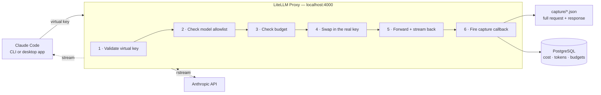

# LiteLLM Gateway — Configuration, Flow, and Captured Data

A walkthrough of the message-capture gateway: how it is configured, how traffic
flows through it, how to use it, and exactly what it records — illustrated with
a real captured session.

_Prepared 19 Aug 2026. Reference session: `f09f6489-a630-4393-829f-5c3d3cbadffe`._

---

## 1. What this is, in one line

A gateway that sits between Claude Code and Anthropic, so that **every request and
response passes through infrastructure we control** — giving us message capture,
per-developer keys, spend budgets, and cost visibility that we do not get when
developers talk to the provider directly.

---

## 2. The flow

### 2.1 Before and after, in one picture

**Before — no gateway.** The developer's machine holds the real provider key and
talks straight to Anthropic. Nobody else can see what was sent, what came back, or
what it cost.

```
   ┌──────────────┐                                  ┌──────────────┐
   │ Claude Code  │ ───── real API key ────────────▶ │  Anthropic   │
   │ (developer)  │ ◀──────── response ───────────── │     API      │
   └──────────────┘                                  └──────────────┘

        No record.  No budget.  No visibility.  Key sits on the laptop.
```

**After — with the gateway.** Everything goes through a service we run.

```
   ┌──────────────┐          ┌──────────────────┐          ┌──────────────┐
   │ Claude Code  │ ──(1)──▶ │  LiteLLM Proxy   │ ──(2)──▶ │  Anthropic   │
   │ (developer)  │          │  localhost:4000  │          │     API      │
   │              │ ◀─(4)─── │                  │ ◀──(3)── │              │
   └──────────────┘          └────────┬─────────┘          └──────────────┘
                                      │
                                     (5)
                          ┌───────────┴───────────┐
                          ▼                       ▼
                ┌──────────────────┐    ┌──────────────────┐
                │  capture/*.json  │    │   PostgreSQL     │
                │  full request +  │    │  cost · tokens   │
                │  full response   │    │  keys · budgets  │
                └──────────────────┘    └──────────────────┘

   (1) developer's VIRTUAL key      (2) swapped for the REAL key
   (3) response streams back        (4) relayed to the developer
   (5) both sides recorded
```

### 2.2 What the proxy does with a single request

Each numbered step is a gate. If a check fails, the request stops there and never
reaches Anthropic — nothing is billed.

```
   request arrives at localhost:4000
            │
            ▼
   ┌────────────────────────────────┐
   │ 1. Is this virtual key real?   │──── no ──▶ 401  rejected, nothing billed
   └────────────┬───────────────────┘
                │ yes
                ▼
   ┌────────────────────────────────┐
   │ 2. Is this model allowed       │──── no ──▶ 403  "key can only access
   │    for this key?               │                  models=[...]"
   └────────────┬───────────────────┘
                │ yes
                ▼
   ┌────────────────────────────────┐
   │ 3. Is the key within budget?   │──── no ──▶ 429  budget exceeded
   └────────────┬───────────────────┘
                │ yes
                ▼
   ┌────────────────────────────────┐
   │ 4. Replace the virtual key     │   the real key never leaves the proxy
   │    with the REAL provider key  │
   └────────────┬───────────────────┘
                │
                ▼
   ┌────────────────────────────────┐
   │ 5. Forward to Anthropic,       │
   │    stream the answer back      │
   └────────────┬───────────────────┘
                │
                ▼
   ┌────────────────────────────────┐
   │ 6. Fire the capture callback   │   writes JSON files + database rows
   └────────────────────────────────┘
```

Step 2 is not theoretical — we saw it fire live during setup:

```
403 key not allowed to access model.
    This key can only access models=['claude-haiku-4-5-20251001']
```

That is LiteLLM's wording, not Anthropic's. The gateway inspected the request and
refused it before a single token was billed.

### 2.3 The same flow as a rendered diagram

_(renders in GitHub, GitLab, and VS Code with a Mermaid extension)_



### 2.4 Why this shape matters

**The real key never leaves the proxy.** Developers hold a virtual key that is
useless outside our network. Revoking someone's access is one database row — no
key rotation, no redeployment, no coordination.

**Every gate is ours.** Model allowlists, budgets, and capture are enforced by
infrastructure we operate, not by asking developers to be careful.

**Capture is a side effect of the path, not an extra step.** Because the traffic
must pass through step 5 to work at all, step 6 cannot be skipped or forgotten.

---

## 3. What kind of deployment this is

LiteLLM ships in two forms. This is the **Proxy Server**, not the Python SDK.

| | Python SDK | **Proxy Server (what we run)** |
|---|---|---|
| Form | `pip install litellm`, imported into your app | Standalone HTTP service |
| Virtual keys / budgets | Not available | Yes |
| Admin UI | Not available | Yes, at `/ui` |
| Can intercept Claude Code | No | Yes |

The SDK was never an option here: Claude Code is a binary we do not control and
cannot add an import to. The only way to sit in its path is to be an HTTP endpoint
it can be pointed at.

---

## 4. Configuration

### 4.1 Files

| File | Purpose |
|---|---|
| `docker-compose.yml` | Runs the proxy + PostgreSQL |
| `config.yaml` | Model list, master key, capture callback |
| `custom_capture.py` | The capture callback (writes the JSON files) |
| `.env` | Holds `ANTHROPIC_API_KEY` and `LITELLM_MASTER_KEY` (git-ignored) |
| `capture/` | Captured exchanges |
| `verify.py` | Scorecard over the capture directory |
| `FINDINGS.md` | Full fidelity test results |

### 4.2 `config.yaml` — the three things that matter

**Model list.** Each entry maps a name clients request to a provider model, with
the real key injected from the environment:

```yaml
model_list:
  - model_name: claude-haiku-4-5-20251001
    litellm_params:
      model: anthropic/claude-haiku-4-5-20251001
      api_key: os.environ/ANTHROPIC_API_KEY
```

A client can only use model names listed here. Anything else is rejected by the
proxy before it reaches Anthropic.

**Capture callback.** This is what writes the JSON files:

```yaml
litellm_settings:
  drop_params: false                    # never silently discard request fields
  callbacks: custom_capture.handler
```

`drop_params: false` is deliberate and important. If LiteLLM silently dropped
request fields it did not recognise, new Claude Code capabilities would vanish
without an error — the worst possible failure mode for a capture gateway.

**Persistence:**

```yaml
general_settings:
  master_key: os.environ/LITELLM_MASTER_KEY
  database_url: os.environ/DATABASE_URL
  store_prompts_in_spend_logs: true
```

### 4.3 Credentials

Two secrets, both supplied through `.env` so they never appear in the config files:

| Variable | What it is | Who holds it |
|---|---|---|
| `ANTHROPIC_API_KEY` | The real provider key | The proxy only |
| `LITELLM_MASTER_KEY` | Admin password for the proxy and its UI | Gateway administrator |

Virtual keys are generated by the proxy and are what developers actually use.

---

## 5. How to use it

### 5.1 Start the gateway

```bash
cd litellm-gateway
docker compose up -d
docker compose ps          # both services should be up / healthy
```

### 5.2 Issue a developer a virtual key

```bash
curl -s -X POST http://localhost:4000/key/generate \
  -H "Authorization: Bearer $LITELLM_MASTER_KEY" \
  -H "Content-Type: application/json" \
  -d '{"models":["claude-haiku-4-5-20251001"],
       "max_budget":5,
       "metadata":{"developer":"asif.hussain"}}'
```

The response contains `"key": "sk-..."`. This key:

- works **only** through our gateway
- works **only** for the models listed
- stops working once `max_budget` is reached
- is attributable to a named developer

### 5.3 Point Claude Code at the gateway

**CLI** — export two variables, then run `claude`:

```bash
export ANTHROPIC_BASE_URL="http://localhost:4000"
export ANTHROPIC_AUTH_TOKEN="sk-...the virtual key..."
unset ANTHROPIC_API_KEY      # avoids a dual-credential conflict
claude
```

**Desktop app** — GUI apps do not inherit shell exports, so put the same values in
`~/.claude/settings.json` and fully quit + reopen the app:

```json
{
  "env": {
    "ANTHROPIC_BASE_URL": "http://localhost:4000",
    "ANTHROPIC_AUTH_TOKEN": "sk-...the virtual key..."
  }
}
```

### 5.4 Confirm traffic was captured

```bash
ls -lt capture/                      # a new session folder appears
python3 verify.py                    # scorecard over what was captured
```

---

## 6. Proving traffic really goes through the gateway

Five independent pieces of evidence, all taken from the reference session:

| # | Evidence | Why it is conclusive |
|---|---|---|
| 1 | Captured header `"host": "localhost:4000"` | Direct traffic would show `api.anthropic.com` |
| 2 | Request body contains `litellm_metadata`, `litellm_session_id`, `litellm_trace_id` | Fields the provider API does not define — only the proxy injects them |
| 3 | Virtual key `sk-...81Ww` shows `spend = $0.115` of its `$5` budget | That key exists only in our database; Anthropic has never seen it |
| 4 | Error observed live: `403 key not allowed to access model. This key can only access models=[...]` | LiteLLM's wording, not Anthropic's — the gateway inspected and rejected |
| 5 | The capture files exist at all | Written by a callback running **inside** the proxy — no proxy, no files |

**The decisive live demo:** stop the proxy (`docker compose stop litellm`) and run
Claude Code with the same settings. It fails to connect — proving the gateway is
carrying the traffic, not merely observing it. Restart with `docker compose start litellm`.

---

## 7. What gets captured — reference session `f09f6489`

### 7.1 The headline finding

**One user question produced four separate API calls.**

The user typed a single message: _"what is the difference between claude haiku and
opus?"_ Claude Code made four billed requests to satisfy it. Without a capture
layer, three of those four are invisible.

| # | Timestamp | What it actually was | Visible to the user? | Input tokens | Cost |
|---|---|---|---|---|---|
| 1 | 14:02:35 | Conversation **title generation** → `{"title": "Claude Haiku and Opus differences"}` | No — internal | 901 | $0.000981 |
| 2 | 14:02:37 | The question → model decides to call `Skill(claude-api)` | Partly (`⏺ Skill(...)` line) | 47,718 | $0.061330 |
| 3 | 14:02:54 | Skill loaded → **the full answer** with comparison tables | Yes | 74,842 | $0.042346 |
| 4 | 14:06:03 | The **recap line** at the bottom of the screen | Yes, easily missed | 75,650 | $0.010641 |
| | | | **Total** | **199,111** | **$0.1153** |

This is the single most valuable thing the gateway shows. A team estimating cost
from "how many questions did we ask" will be wrong by roughly **4x**.

### 7.2 Files on disk

```
capture/
├── index.jsonl                                    one summary line per exchange
├── f09f6489-a630-4393-829f-5c3d3cbadffe/          one folder per Claude Code session
│   ├── 001.title.request.json                       18 KB
│   ├── 001.title.response.json                     1.4 KB
│   ├── 002.tool-call-skill.request.json            411 KB
│   ├── 002.tool-call-skill.response.json           8.9 KB
│   ├── 003.answer.request.json                     609 KB
│   ├── 003.answer.response.json                    9.7 KB
│   ├── 004.recap.request.json                      618 KB
│   └── 004.recap.response.json                      12 KB
└── _kwargs/                                       raw callback payloads (debugging only)
```

The whole session is readable from the filenames alone: a title was generated, a
skill was invoked, an answer was produced, a recap was written. **`003.answer` is
the only one the user asked for.**

Folders are named by Claude Code's own session id, taken from the
`x-claude-code-session-id` header. Exchanges are numbered in arrival order, so
`003.answer.request.json` and `003.answer.response.json` are two halves of one
exchange.

Labels are derived at capture time:

| Label | How it is determined |
|---|---|
| `tool-call-<name>` | Response `finish_reason` is `tool_calls`; name taken from the call |
| `title` | Final user instruction contains "Write the title" |
| `recap` | Final user instruction asks for a recap |
| `utility` | No tools offered — a side call |
| `answer` | Anything else that completed normally |
| `error` | The exchange failed |

The **sequence number is authoritative**; the label is best effort. It keys off
instruction text Claude Code sends, which may change between releases — a wrong
label is cosmetic and never data loss. `index.jsonl` records the sequence, the
filename, and the original nanosecond timestamp.

Note the request sizes: **609 KB for a single turn.** Claude Code resends the
entire conversation on every call, which is why capture volume grows quickly.

### 7.3 What is inside a captured request

Top-level keys of the request body:

```
model              messages           system             tools
max_tokens         stream             thinking           metadata
context_management litellm_metadata   litellm_session_id litellm_trace_id
```

For exchange 3 specifically:

| Field | Value | Why it matters |
|---|---|---|
| `model` | `claude-haiku-4-5-20251001` | Exact model billed |
| `system` | **3 blocks** (array, not string) | Preserved as an array — collapsing it would break prompt caching and raise input cost ~10x |
| `tools` | **34 definitions** | Every tool Claude Code offered the model |
| `messages` | 3 turns: `user` → `assistant` (thinking + tool_use) → `user` (tool_result) | Full conversation state including the model's reasoning |
| `stream` | `true` | Streamed response |

The `messages` array contains the content blocks that carry the real substance:

- `text` — the user's prompt and instructions
- `thinking` — the model's internal reasoning, captured verbatim
- `tool_use` — which tool was invoked and with what arguments
- `tool_result` — **file contents and command output returned to the model**

That last one is most of the value of capturing at all: it is where source code
and command output actually flow.

### 7.4 What is inside a captured response

```json
{
  "ok": true,
  "response": {
    "id": "4c9e0698-...",
    "model": "claude-haiku-4-5-20251001",
    "choices": [{ "finish_reason": "stop", "message": { "content": "...", "thinking_blocks": [...] } }],
    "usage": { "prompt_tokens": 74842, "completion_tokens": 732,
               "cache_read_input_tokens": 47708, "cache_creation_input_tokens": 27124 }
  }
}
```

Verified against the reference session: the `content` field of exchange 3 holds the
**complete answer** that appeared on screen — comparison tables, cost figures,
recommendations, in full. Nothing is truncated or summarised.

`finish_reason` distinguishes the call types: `tool_calls` on exchange 2 (the model
stopped to invoke a skill) versus `stop` on exchange 3 (a completed answer).

### 7.5 Prompt caching — captured, and it works

The token fields show caching operating across the session:

| Exchange | Cache **written** | Cache **read** | Cost | Note |
|---|---|---|---|---|
| 1 | 0 | 0 | $0.000981 | Small call, nothing to cache |
| 2 | 47,708 | 0 | $0.061330 | Builds the cache — writes cost ~1.25x |
| 3 | 27,124 | **47,708** | $0.042346 | First cache hit |
| 4 | 739 | **74,832** | $0.010641 | Almost entirely cache — **cheapest despite the most tokens** |

Exchange 4 processed the largest context of all four (75,650 tokens) yet cost less
than a fifth of exchange 2, because 74,832 of those tokens were served from cache
at ~10% of normal price.

**This is the cost argument, backed by captured data rather than a claim.** Without
caching, exchanges 3 and 4 would have been billed roughly 150k tokens at full rate
instead of ~28k.

Caching is also a fidelity test the gateway passes: the `system` array arrives at
the provider still an array, with its blocks unmerged and in original order. Had
the proxy reshaped it, caching would have silently stopped working and input costs
would have risen roughly tenfold with no error message anywhere.

### 7.6 Attribution

Every exchange carries `x-claude-code-session-id`, so exchanges group into
conversations automatically. Sub-agent traffic carries `x-claude-code-agent-id` and
`x-claude-code-parent-agent-id`, which will let us attribute nested agent work once
we exercise it.

---

## 8. Where the data lands — two stores

| | `capture/*.json` files | PostgreSQL |
|---|---|---|
| Full request body (prompt, system, tools) | Yes | **Yes** — in `proxy_server_request` |
| Full response body | Yes | Yes |
| Token counts / caching | Yes | Yes |
| Cost in USD | No | **Yes** |
| Per-key budgets, admin UI | No | Yes |
| Session grouping | Folder name | `session_id` column |

Both stores hold the complete exchange. Verified on the reference session:

| Column | Size per row | Contents |
|---|---|---|
| `proxy_server_request` | 106–116 KB | `messages`, `system`, `tools`, `model`, `thinking`, `max_tokens` |
| `response` | 1–11 KB | Full response body including token usage |
| `messages` | `{}` | Empty — **not** the column to read; the request lives in `proxy_server_request` |

That last row is the trap. A query against `messages` returns nothing and looks
like the prompts were never stored. They were — under `proxy_server_request`. If
the admin UI's request panel appears blank, this is the likely reason.

Useful queries for the demo:

```bash
# Spend and caching, straight from the database
docker exec -it litellm-gateway-postgres-1 psql -U litellm -d litellm -c \
  'SELECT "startTime", model, prompt_tokens, completion_tokens,
          cache_read_input_tokens, spend
   FROM "LiteLLM_SpendLogs" ORDER BY "startTime" DESC LIMIT 10;'
```

```bash
# The user's own prompts, recovered from the database
docker exec -it litellm-gateway-postgres-1 psql -U litellm -d litellm -c \
  "SELECT m->'content'->-1->>'text'
   FROM \"LiteLLM_SpendLogs\", LATERAL jsonb_array_elements(proxy_server_request->'messages') m
   WHERE session_id = 'f09f6489-a630-4393-829f-5c3d3cbadffe'
     AND m->>'role' = 'user' LIMIT 5;"
```

```bash
# Per-developer key spend against budget
docker exec -it litellm-gateway-postgres-1 psql -U litellm -d litellm -c \
  'SELECT key_name, spend, max_budget, models
   FROM "LiteLLM_VerificationToken" WHERE spend > 0;'
```

The admin UI at `http://localhost:4000/ui` shows the same data — log in with the
master key.

---

## 9. Known gaps — state these openly

Three limitations, all verified rather than assumed:

**1. Unrecognised `anthropic-beta` headers are dropped.** On the `/v1/messages`
route, a beta capability value sent by the client does not reach the provider.
LiteLLM auto-injects headers for capabilities it recognises, so current features
work — but a *new* Claude Code release shipping an unknown beta can produce a hard
`400`, not a graceful degradation. Root cause traced to LiteLLM's source; four
config workarounds tested, none effective. Full analysis in `FINDINGS.md`.

*Next action:* test the `/anthropic/*` passthrough route, which may forward headers
verbatim and make this moot. This requires a real API key, which we now have.

**2. Streaming capture is normalised, not byte-exact.** For streamed requests the
callback receives LiteLLM's reassembled response object rather than the provider's
raw SSE bytes. Content is complete and faithful; the byte stream is not preserved.
This is inherent to callback-based capture. If a byte-exact record is ever required
for audit, it needs a tap in the data path — already demonstrated in `../capture-tap/`.

**3. The database's `messages` column is empty.** The request is stored in
`proxy_server_request` instead (section 8). Nothing is lost, but a query or UI panel
pointed at `messages` will look empty and invite the wrong conclusion.

### Fidelity test results

Against a stub upstream, **15 of 16 checks pass** (`FINDINGS.md`). The two that
could have ruled LiteLLM out both passed:

- **Survives a 310-second silent gap.** Claude Code aborts a stream after 300s of
  silence. LiteLLM relays keep-alive pings, so long thinking pauses survive. No
  configuration could have fixed a failure here.
- **Prompt caching is not defeated.** Confirmed again on real traffic in this
  session — 74,832 cached tokens read on exchange 4.

The single failure is the `anthropic-beta` gap above.

---

## 10. Where this goes next

Everything above runs on `localhost`. To make it a shared service:

| Step | What changes |
|---|---|
| Host it | Compose stack on a shared VM, not a laptop |
| Give it a name | `ANTHROPIC_BASE_URL=https://llm-gw.<internal-domain>` |
| TLS | nginx/Caddy in front — auth tokens must not cross the network in plaintext |
| Lock down PostgreSQL | Remove the `5432:5432` port mapping (PoC convenience only) |
| One key per developer | Mint with `metadata.developer` + `max_budget` so spend is attributable |
| Distribute settings | Managed configuration so developers do not set variables by hand |
| Retention policy | Captures contain source code and command output — decide who may read them and for how long |

**Open decision.** Three options, on the evidence above:

| Option | When it is the right call |
|---|---|
| **Adopt LiteLLM** | If the passthrough route forwards `anthropic-beta` and still logs |
| **Hybrid** | LiteLLM for keys, budgets, and UI; a thin byte-level tap in the data path for faithful capture |
| **Build** | If neither LiteLLM route is both faithful and logged |

The immediate next step is the passthrough-route test, which is now unblocked.

---

## Appendix — demo script

1. **Show the gateway running** — `docker compose ps`
2. **Show a virtual key being issued**, scoped to one model with a $5 budget
3. **Run a Claude Code session** through it; ask one question
4. **Open the capture folder** — show request and response JSON side by side
5. **Show the four-calls-for-one-question table** (section 7.1) — the headline
6. **Show the caching table** (section 7.5) — the cost argument
7. **Show spend in the database or admin UI** — attribution and budget
8. **Stop the proxy and retry** — Claude Code fails; the gateway is genuinely in the path
9. **State the three known gaps** (section 9) plainly
