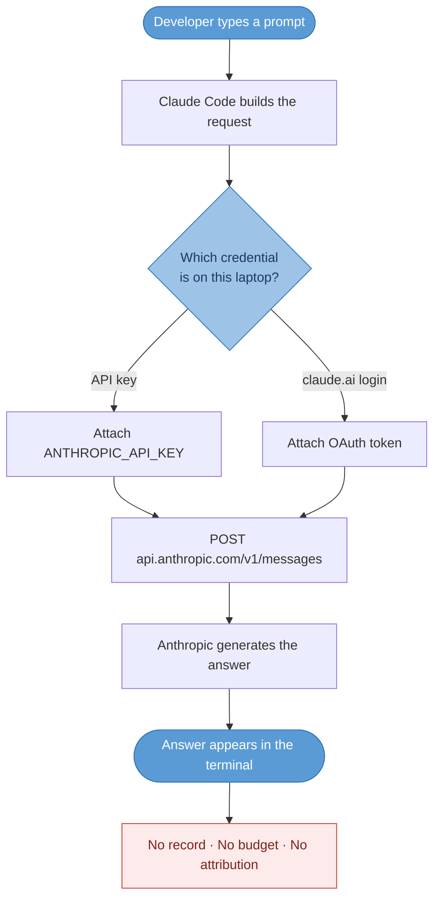
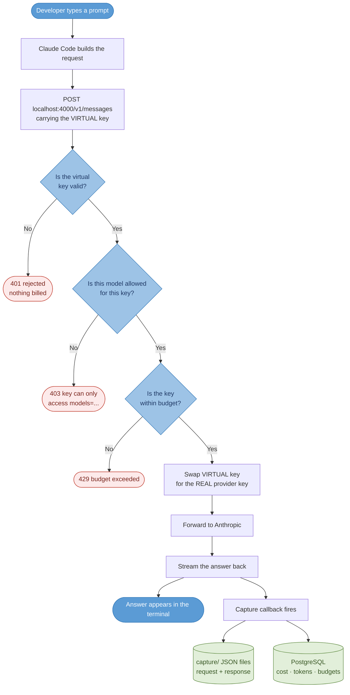
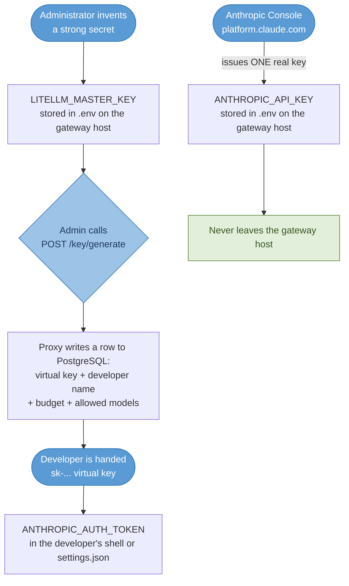
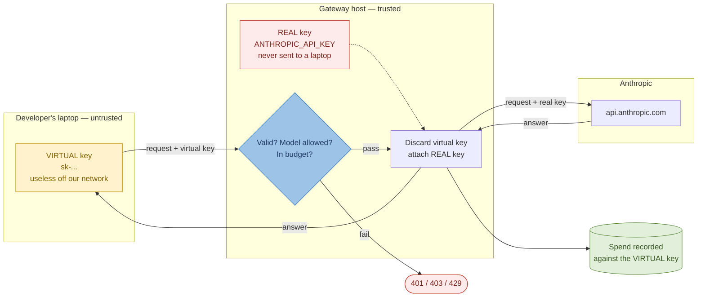
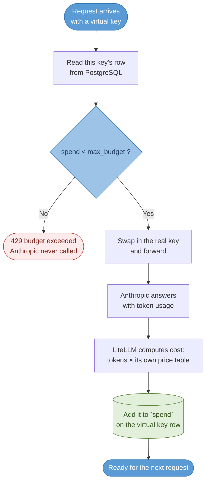
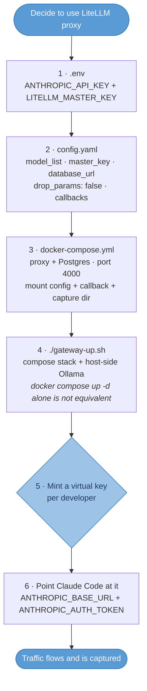

# Claude Code Capture Gateway — Overview

A plain explanation of what we built, in seven sections:

1. [Flow — Claude Code without the gateway](#1-flow--claude-code-without-the-gateway)
2. [Flow — Claude Code with the gateway](#2-flow--claude-code-with-the-gateway)
3. [Flow — how the keys work](#3-flow--how-the-keys-work)
4. [What is inside the capture files](#4-what-is-inside-the-capture-files)
5. [What you must configure to run LiteLLM as the proxy](#5-what-you-must-configure-to-run-litellm-as-the-proxy)
6. [Every file, in one line](#6-every-file-in-one-line)
7. [Demo run sheet](#7-demo-run-sheet)

---

## 1. Flow — Claude Code without the gateway

The default. The credential sits on the laptop and the conversation goes straight
to Anthropic.



**Explain it in three sentences:**

- The credential lives on the laptop — an API key, or the developer's claude.ai login.
- The conversation goes directly to Anthropic; nobody in the company sees it.
- There is no spend limit, no per-developer figure, and no model restriction.

**The problem:** if a developer pastes client code into Claude Code, we have no
record it happened. And if a key leaks, it must be rotated on every laptop.

---

## 2. Flow — Claude Code with the gateway

We put a service we run in the middle. Claude Code is simply told a different
address — nothing is patched or reverse-engineered.

Each diamond is a gate. **If a gate fails, the request stops there and Anthropic
is never called, so nothing is billed.**



**Explain it step by step:**

| Step | What happens |
|---|---|
| 1 | Claude Code sends the request to our gateway using the **virtual key** we issued |
| 2 | The gateway checks the key is real, the model is permitted, and the budget is not spent |
| 3 | The gateway swaps the virtual key for the **real Anthropic key**, which never leaves the server |
| 4 | Anthropic's answer streams back through the gateway |
| 5 | Claude Code shows it — the developer sees a completely normal session |
| 6 | The gateway writes request and response to disk, and the cost to the database |

**Three points worth emphasising:**

- **The real key never leaves the server.** Revoking someone is one database row — no rotation, no redeployment.
- **Capture cannot be skipped.** Traffic must pass through the gateway to work at all, so recording is a property of the path, not an extra step.
- **The gates are real, not theoretical.** Verified on this gateway 21 Aug 2026,
  asking for Opus on a key scoped to Haiku only:
  ```
  key not allowed to access model.
  This key can only access models=['claude-haiku-4-5-20251001'].
  Tried to access claude-opus-5
          code: 403   type: key_model_access_denied
  ```
  That is LiteLLM's own wording, not Anthropic's — proof the gateway inspected
  and refused the request itself, before any token was billed.

**One thing that surprises people:** a single typed question is not one API call.
In our reference session one user question produced **four** billed calls — a
title generation, a tool-call decision, the answer, and a closing recap. Three of
the four are invisible without capture, so estimating cost from "how many
questions did we ask" is wrong by roughly 4×.

---

## 3. Flow — how the keys work

Four credentials exist, and the separation between them *is* the design.

### 3.1 Where each key comes from



### 3.2 The swap — what happens to keys on every request

This is the security idea in one picture. The dashed line is the trust boundary:
the real key never crosses it outward.



**The sentence that explains the whole design:** Anthropic only ever sees the real
key, developers only ever hold a virtual key, and spend is recorded against the
virtual key — so we get attribution without ever distributing the real credential.

### 3.3 The four credentials

| # | Credential | Who holds it | What it can do | If it leaks |
|---|---|---|---|---|
| 1 | `ANTHROPIC_API_KEY` | Gateway host only | Spend real money at Anthropic | **Worst case.** Rotate at Anthropic immediately |
| 2 | `LITELLM_MASTER_KEY` | Administrator | Mint and revoke keys, log into the dashboard, read captured prompts | Serious — attacker can issue themselves keys |
| 3 | **Virtual keys** (one per developer) | Each developer | Call only allowed models, only up to budget, only through our gateway | **Low.** Worthless off our network; revoke one row |
| 4 | PostgreSQL user/password | The proxy container | Read/write the key and spend tables | Internal only; not user-facing |

### 3.4 What a virtual key buys us

Minted with the developer's name and a budget attached:

```bash
curl -s -X POST http://localhost:4000/key/generate \
  -H "Authorization: Bearer $LITELLM_MASTER_KEY" \
  -H "Content-Type: application/json" \
  -d '{"models":["claude-haiku-4-5-20251001"],
       "max_budget":5,
       "metadata":{"developer":"asif.hussain"}}'
```

| Property | Effect |
|---|---|
| Attributable | Spend is tied to a named person, not a shared pool |
| Budgeted | Stops the **next** request once `max_budget` is passed — see 3.5 |
| Scoped | Works only for the models listed |
| Revocable | Delete one database row — no rotation, no redeployment |

> **Open item:** the master key is hand-chosen rather than generated, and the
> dashboard signs in as `admin` with that same value.
>
> *Re-verified 22 Sep 2026:* the earlier form of this note — that the key was a
> placeholder published as an example in `litellm-gateway/README.md` — **no longer
> applies.** `config.yaml` reads `os.environ/LITELLM_MASTER_KEY`, and no literal
> key appears in any README or tracked file. What remains is the decision, not the
> leak: the operative key is whatever a human typed into `.env`.
>
> Tolerable while everything is bound to `localhost`, but it is the credential
> that mints keys, revokes them, and can read every captured prompt — so it must
> be replaced with a generated secret before this runs on a shared machine.
> Rotating it invalidates existing virtual keys, so do it before handing keys out.

### 3.5 How the budget check works before the key swap

A fair question this raises: if the money lives with the **real** Anthropic key,
how can the gateway check the budget *before* swapping it in?

**Because the budget has nothing to do with the real key.** `max_budget` is a
number LiteLLM stores in the virtual key's own PostgreSQL row, and the check is a
plain local database read — no network call, no real key required. That is exactly
why it can happen before the swap.



**The consequence: the budget is retrospective, not pre-authorising.** LiteLLM
cannot know a request's cost before making it, so the request that breaches the
ceiling still completes. Demonstrated on this gateway with a key capped at
$0.000001:

| | Result |
|---|---|
| Call 1 | **Succeeded** — `spend` was still 0 when the gate was checked |
| Call 2 | `429 Budget has been exceeded! Current cost: 2.9e-05, Max budget: 1e-06` |

It overshot the ceiling **29×** before stopping. With a large Opus request that
could be dollars, and concurrent requests can each pass the check before any of
them writes its spend. So describe `max_budget` as *"stops the next request"*,
never as a hard spend cap.

**There are two independent ceilings, and neither knows about the other:**

| | Enforced by | How | When exceeded |
|---|---|---|---|
| `max_budget` per virtual key | **LiteLLM** | Its own ledger of computed spend in PostgreSQL | `429` at the gateway; Anthropic never called |
| Account credit | **Anthropic** | Real billing against the real key | Anthropic returns an error through the proxy |

Every key could have a $1,000 budget and still be stopped by an empty Anthropic
account — or the account could be flush and a $5 key budget still stops the developer.

> **Worth knowing when adding models:** the spend figure is LiteLLM's own
> arithmetic — tokens × its price table — not an invoice from Anthropic. If a
> model has no price data, cost computes as `0`, spend never accrues, and the
> budget would never trip. Check price data whenever a model is added.

---

## 4. What is inside the capture files

Two files per exchange, plus one summary line:

```
capture/
├── index.jsonl                          one summary line per exchange
└── <session-id>/
    ├── 003.answer.request.json          what Claude Code sent
    └── 003.answer.response.json         what came back
```

Everyone assumes these hold the question and the answer. They hold much more —
this is the section that matters for a data-handling review.

### 4.1 In the request file

| # | What it is | Why it matters |
|---|---|---|
| 1 | **Claude Code's system prompt** — 3 blocks, ~27 KB | Its operating instructions, resent on every call |
| 2 | **Tool catalogue** — 34 definitions | Every capability offered: file read/write, shell, search, web |
| 3 | **`tool_use` blocks** | Which tool ran **and its arguments** — the file paths opened, the shell commands run |
| 4 | **`tool_result` blocks** | ⚠️ **The actual file contents and command output fed back to the model.** Where source code lives |
| 5 | **The model's `thinking`** | Internal reasoning, verbatim |
| 6 | **Full conversation history** | Resent every turn — one turn measured **609 KB** |
| 7 | **Machine fingerprint** (headers) | OS (`MacOS`), CPU (`arm64`), Node (`v26.3.0`), CLI version |
| 8 | **Session and agent IDs** | Groups exchanges into conversations; identifies sub-agent work |
| 9 | **Model settings** | Model, `max_tokens`, thinking budget, streaming flag |
| 10 | **Enabled beta features** | The `anthropic-beta` header |
| 11 | **Gateway-injected IDs** | `litellm_session_id`, `litellm_trace_id` — added by our proxy |

**Items 3, 4 and 6 are the sensitive ones.** A capture file is not a chat log; it
records which files were opened, which commands ran, what they printed, and the
code involved. Item 7 additionally fingerprints the developer's machine.

### 4.2 In the response file

| What it is | Why it matters |
|---|---|
| The answer text | The visible part |
| `thinking_blocks` | The model's reasoning, structured |
| `tool_calls` | Which tool the model asked to run next |
| `finish_reason` | Completed answer (`stop`) vs. pause to call a tool (`tool_calls`) |
| Token counts | `prompt_tokens`, `completion_tokens`, `reasoning_tokens` |
| Caching figures | `cache_read_input_tokens`, `cache_creation_input_tokens` |

Two quirks worth knowing:

- Responses are stored in **OpenAI's shape**, not Anthropic's — `choices[0].message.content`, not `content[]`. That is LiteLLM's normalisation.
- Anthropic's own `msg_…` id is **not** preserved, so a captured exchange cannot be matched to a record on Anthropic's side.

### 4.3 Where the cost figure lives

Capture files hold the content; **PostgreSQL holds the money.** Cost in USD,
per-key spend and budgets are in the database, not the JSON.

> A trap: the database's `messages` column is empty — the request is stored in
> `proxy_server_request`. A query or dashboard panel pointed at `messages` looks
> blank and invites the wrong conclusion.

### 4.4 Consequence

Because of items 3, 4, 6 and 7, capture files are **confidential client data, not
logs.** They are git-ignored today. Retention, who may read them, and where they
are stored are open policy questions — worth raising with the security owner
before this becomes a shared service.

---

## 5. What you must configure to run LiteLLM as the proxy

Adopting the proxy means configuring five things. Nothing else is required — no
certificates, no patched binary, no MITM.



### 5.1 `.env` — the two secrets

```
ANTHROPIC_API_KEY=sk-ant-…      # real provider key; stays on the gateway host
LITELLM_MASTER_KEY=…            # admin credential for the proxy and dashboard
```

### 5.2 `config.yaml` — three things that matter

**Model list** — a client can only request a model named here:

```yaml
model_list:
  - model_name: claude-haiku-4-5-20251001
    litellm_params:
      model: anthropic/claude-haiku-4-5-20251001
      api_key: os.environ/ANTHROPIC_API_KEY
```

**The capture callback** — the line that makes it a *capture* gateway:

```yaml
litellm_settings:
  drop_params: false                    # never silently discard request fields
  callbacks: custom_capture.handler
```

`drop_params: false` is deliberate: if LiteLLM silently dropped fields it did not
recognise, a new Claude Code capability would vanish with no error — the worst
failure mode for something whose job is to record faithfully.

**Persistence:**

```yaml
general_settings:
  master_key: os.environ/LITELLM_MASTER_KEY
  database_url: os.environ/DATABASE_URL
  store_prompts_in_spend_logs: true
```

### 5.3 `docker-compose.yml` — what runs

| Service | Port | Purpose |
|---|---|---|
| **litellm** | 4000 | The proxy — what Claude Code talks to |
| **postgres** | 5432 | Virtual keys, budgets, spend, dashboard data |

It also mounts `config.yaml` and `custom_capture.py` read-only, mounts `capture/`
for output, and sets `CAPTURE_DIR`, `CAPTURE_KWARGS_DUMPS` and `DATABASE_URL`.

We run LiteLLM's **Proxy Server**, not its Python SDK. The SDK was never an
option: Claude Code is a binary we cannot add an import to, so the only way to sit
in its path is to be an HTTP endpoint it can be pointed at.

### 5.4 On the Claude Code side — two variables

**CLI:**

```bash
export ANTHROPIC_BASE_URL="http://localhost:4000"
export ANTHROPIC_AUTH_TOKEN="sk-…the virtual key…"
unset ANTHROPIC_API_KEY
claude
```

Confirm with `/status` — you want a base URL line naming the proxy.

**Desktop app:** a GUI app never sees shell exports, so the same values go in
`~/.claude/settings.json` under `env`, then fully quit and reopen the app.

### 5.5 The dashboard

`http://localhost:4000/ui` — log in as `admin` with the master key. Shows virtual
keys and their spend against budget, per-request usage logs, and the registered
models.

---

## 6. Every file, in one line

### The gateway (`litellm-gateway/`)

| File | What it is |
|---|---|
| `docker-compose.yml` | Runs the two containers — LiteLLM proxy on `:4000` and PostgreSQL — with volumes and environment wired up |
| `config.yaml` | The proxy's own configuration: which models exist, the master key, the database, and the capture callback |
| `custom_capture.py` | The code **we wrote** — LiteLLM calls it after every exchange and it writes the request/response JSON files |
| `verify.py` | Scorecard that reads the capture directory and reports which fidelity checks pass |
| `.env` | The two secrets, `ANTHROPIC_API_KEY` and `LITELLM_MASTER_KEY` (git-ignored, never committed) |
| `capture/` | Output — one folder per session holding request/response JSON, plus `index.jsonl` |
| `README.md` | How to run the gateway and the nine fidelity checks to perform |
| `DEMO.md` | The full walkthrough: configuration, flow, and a real captured session analysed |
| `FINDINGS.md` | Results of the 16-point fidelity test (15 pass) and the `anthropic-beta` root-cause analysis |
| `PROJECT-STATUS.md` | Status report — action items, what is proven, what is open |
| `STUB.md` | How to run the fidelity checks with no API key and no spend |
| `run_checks.py` | The 16-point fidelity harness, driven with Claude-Code-shaped requests |
| `stub/stub_upstream.py` | A fake Anthropic upstream that records what it received and can misbehave on cue |
| `config.stub.yaml` | Copy of `config.yaml` with every model pointed at the local stub instead of Anthropic |
| `config.stub.local.yaml` | Same idea, for running the stub outside Docker |
| `docker-compose.stub.yml` | Compose overlay that swaps in the stub config so tests cost nothing |

### The repository root

| File | What it is |
|---|---|
| `README.md` | Entry point — what the PoC is, how to run it, and the data-handling rules |
| `GATEWAY-OVERVIEW.md` | This document |
| `.gitignore` | Keeps secrets and all captured traffic out of git — captures must never be committed |
| `Emumba_PoC_Enterprise_Control_Plane.html` | The PoC overview deck |
| `capture-tap/tap.py` | The **alternative approach** — a thin byte-level tap in the data path, byte-faithful where the callback is normalised |
| `capture-tap/export_captures.py` | Turns tap captures into a CSV for review |

---

## 7. Demo run sheet

Verified working on this machine immediately before the demo.

| # | Do this | What it shows |
|---|---|---|
| 1 | `cd litellm-gateway && docker compose ps` | Gateway and PostgreSQL up — the thing we operate |
| 2 | `claude` with the two variables set, then `/status` | `Anthropic base URL: http://localhost:4000` |
| 3 | Ask one question | A completely normal Claude Code answer |
| 4 | `ls -lt litellm-gateway/capture/` | A session folder appeared **while they watched** |
| 5 | Open `NNN.answer.request.json` | The prompt, plus the system blocks and 34 tool definitions |
| 6 | Open `NNN.answer.response.json` | The full answer, the thinking, the token counts |
| 7 | `cat capture/index.jsonl` | One question → **four** billed calls |
| 8 | Ask for `claude-opus-5` on the **restricted** key | `403 key not allowed to access model…` in LiteLLM's own wording |
| 9 | `http://localhost:4000/ui` (`admin` / master key) | Spend per key against budget |
| 10 | `docker compose stop litellm`, retry | Claude Code fails — the gateway is **carrying** the traffic, not watching it |

Step 10 is the one that lands. Everything before it is consistent with a gateway
that merely observes; only the failure proves it sits in the path.

### Two keys, on purpose

Step 8 needs a key that is *missing* a model. Use the main key for everything
else, so nothing fails unexpectedly in front of an audience.

| Key | Scope | Use it for |
|---|---|---|
| `/tmp/vk_demo.txt` | All four models, $10 budget | Steps 1–7, 9, 10 |
| `/tmp/vk_demo_restricted.txt` | `claude-haiku-4-5-20251001` only, $1 | Step 8 — the `403` |

Verified wording from the restricted key:

```
key not allowed to access model.
This key can only access models=['claude-haiku-4-5-20251001'].
Tried to access claude-opus-5
        code: 403   type: key_model_access_denied
```

### State as of 21 Aug 2026

- **Four models registered, each confirmed live** against Anthropic:
  `claude-opus-5`, `claude-sonnet-5`, `claude-haiku-4-5`, `claude-haiku-4-5-20251001`
- `capture/` empty except `.gitignore`, so the first real session appears clean
- Both containers running; proxy healthy on `:4000`
- Both demo keys minted and tested

Two guessed model IDs (`claude-opus-5-20250805`, `claude-sonnet-5-20250514`) were
removed from `config.yaml` — Anthropic returns `not_found_error` for both, so they
would have failed if anyone selected them mid-demo.

**Pick `claude-haiku-4-5-20251001` as the default demo model.** It is cheap, it is
verified, and it is what Claude Code sends most often in real captured traffic.

> If `verify.py` is run after hand-made `curl` tests it will report
> `FAIL Request completeness` and `FAIL Session attribution`. That is expected —
> raw curl sends no system prompt, no tools, and no `x-claude-code-session-id`.
> Real Claude Code traffic supplies all three. Run it after a genuine session.

---

Related: `DEMO.md` (fuller walkthrough) · `FINDINGS.md` (fidelity results) · `PROJECT-STATUS.md` (status and what remains).
