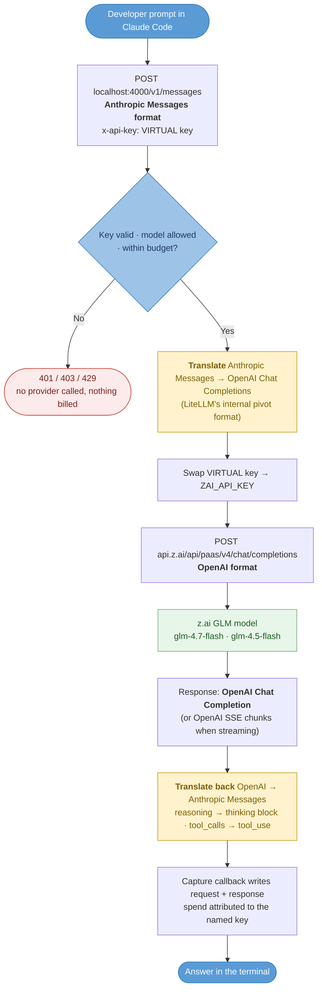

# Enterprise Control Plane for Claude Code — Technical Status Report

**Repository:** `control-plane-gateway` · **Branch:** `skills/emumba-react`
**Prepared:** 31 Aug 2026 (updated — action item 03 delivered) · **Audience:** Project Manager / engineering leadership
**Stage:** Proof of Concept, running on a single developer laptop (`localhost`)

---

## 1. Objective

- Put a **gateway we operate** between Emumba developers' Claude Code and the model provider.
- Four outcomes the PoC set out to prove:
  1. **Capture** — every request and response is recorded, and cannot be bypassed.
  2. **Attribution** — spend is tied to a named developer, not a shared pool.
  3. **Budget control** — a per-developer ceiling that the gateway itself enforces.
  4. **Credential containment** — the real provider API key never reaches a laptop.
- Against that, **five specific action items** were assigned for exploration. Their individual how / why / status is **section 3** — **all five are now complete and verified.** Item 03 (in-flight prompt modification) was delivered on 31 Aug 2026.

---

## 2. Architecture as built

- **Component:** LiteLLM Proxy Server (`ghcr.io/berriai/litellm:main-latest`) + PostgreSQL, via Docker Compose.
- **Services running:** `litellm` (port 4000), `postgres` (5432), `picker-shim` (nginx, port 4001).
- **Path:** Claude Code → `localhost:4000/v1/messages` → key/model/budget checks → real provider key swapped in → Anthropic, OpenRouter, Groq, z.ai, or a local Ollama model → response streamed back → capture callback writes to disk + PostgreSQL.
- **Client configuration is two environment variables** — `ANTHROPIC_BASE_URL` and `ANTHROPIC_AUTH_TOKEN`. Nothing is patched, reverse-engineered, or MITM'd.
- **Custom code we wrote:** `custom_capture.py` (capture callback), `verify.py` (capture scorecard), `verify_modify.py` (modification scorecard), `verify_routing.py` (route-override and model-attribution scorecard), `verify_openai.py` (first-party OpenAI route scorecard), `run_checks.py` (16-point fidelity harness), `stub/stub_upstream.py` (fake provider), `capture-tap/tap.py` (alternative byte-level tap), `claude-gw.sh` (launcher), `picker-shim/nginx.conf`.
- **Deliberate configuration choice:** `drop_params: false` globally, so LiteLLM never silently discards request fields it does not recognise — the worst failure mode for a capture gateway.

### Credential model (the core security idea)

| Credential | Held by | If it leaks |
|---|---|---|
| `ANTHROPIC_API_KEY` (real) | Gateway host only, never distributed | Worst case — rotate at Anthropic |
| `LITELLM_MASTER_KEY` | Administrator | Serious — can mint keys and read captures |
| **Virtual key** (one per developer) | Each developer | Low — worthless off our network; revoke one DB row |
| PostgreSQL credentials | Proxy container | Internal only |

- **Revoking a developer is one database row.** No key rotation, no redeployment across laptops.

---

## 3. Action items — how, why, status

The five capabilities the PoC was asked to explore. **All five are complete and verified.**

### 3.1 Per-user budget enforcement in LiteLLM — ✅ **Done, verified 24–25 Aug 2026**

- **Why:** without a per-person ceiling, a single developer can spend the whole team's allocation, and there is no way to cap exposure before an invoice arrives.
- **How:** LiteLLM stores `max_budget` and `budget_duration` in the credential's own PostgreSQL row. On every request the auth layer reads that row and compares accrued `spend` against the ceiling — a local database read, no network call. Budgets can sit at four levels (**Organization → Team → Internal User → Virtual Key**) and a request is checked against all of them; the most restrictive wins.
- **How it was proven:** a key capped at `max_budget: 0.002`, then real traffic pushed through it. Six calls succeeded, the seventh onward were refused. Documented both ways — dashboard route and a scripted six-step `curl` walkthrough — in `limited_budget_per_dev.md`. Total cost of one full run: **$0.000225**.
- **Status / findings:**
  - **Recommendation: put the cap on the Internal User, not the key**, so it follows the person across every credential they hold. Mint keys with `max_budget` blank.
  - **Refused calls cost nothing** — 13 refused requests logged `0` tokens and `$0`. Stopped at the gateway, never sent to Anthropic. This is the property worth demonstrating.
  - **It is a brake, not a hard cap.** The crossing request always completes, because price is only known after the call. Measured overruns: 12% on a realistic budget, 29× on a deliberately tiny one.
  - **Sizing matters more than expected.** One message reading *"reply with just hi"* cost **$0.18** — Claude Code ships its system prompt and every tool definition on the first message, so ~47k input tokens is the floor for any turn. Start developers at **$20–50/month**.
  - **`Reset Budget: Not set` is a lifetime cap** — without `budget_duration` the budget never refills and the key dies permanently. Always set `monthly`.
  - **Open risk:** over-budget returns `429` from the auth layer, which blocks every route including `/v1/models`. Claude Code cannot distinguish it from a rate limit and burns all ten retries. **Developers will report this as "the gateway is down"** — needs a support runbook.
  - Not yet tested: throttling instead of hard-blocking (`budget_exceeded_throttle_percentage`), and Budget Fallbacks (Opus → Sonnet → Haiku on a per-model budget breach).

### 3.2 Per-user model list changes through LiteLLM — ✅ **Done, verified 21–25 Aug 2026**

- **Why:** the ability to say "this developer may use Haiku but not Opus" is how model cost and data exposure get governed centrally, rather than by asking people nicely.
- **How:** a `models` allowlist on the virtual key, and/or **Personal Models** on the Internal User. Enforcement is in the same auth layer as the budget, so the request is refused before the provider is ever called. Changes are applied in place with `POST /key/update` or `POST /user/new` — the key string, `max_budget` and accrued spend are untouched, so nothing needs re-issuing to the developer.
- **How it was proven:** a key scoped to `claude-haiku-4-5-20251001` was asked for `claude-opus-5`. The refusal came back in **LiteLLM's own wording**, not Anthropic's — proof the gateway inspected and refused the request itself, before any token was billed:
  ```
  key not allowed to access model.
  This key can only access models=['claude-haiku-4-5-20251001'].
  Tried to access claude-opus-5
          code: 403   type: key_model_access_denied
  ```
- **Status / findings:**
  - **Restricting a key to a single model breaks Claude Code mid-session.** It needs a Haiku-class model for background traffic (titles, summaries) *as well as* the model you picked. Scope to a set, not to one.
  - **`no-default-models` blocks at the user level, not the key.** A user created through the UI can carry that sentinel, meaning "no models except through a team" — every call is then refused with a `403` no matter what the key allows. Fix: Personal Models = `all-proxy-models`, or put them in a team.
  - **`GET /v1/models` returns the calling key's allowlist, not the gateway's config.** Add a model to `config.yaml` without updating the key and clients keep seeing the old list — which looks exactly like the config change having failed. Re-run `/key/update` after every model change.

### 3.3 Use LiteLLM as a MITM proxy to modify the prompt in flight — ✅ **Done, verified 31 Aug 2026**

- **Why:** the highest-value control-plane capability of the five. It moves enforcement from credentials and cost onto **content** — injecting standards, redacting secrets before they leave the network, and applying policy to what is actually sent.
- **How:** LiteLLM's `CustomLogger` exposes `async_pre_call_hook(user_api_key_dict, cache, data, call_type)`; returning a `dict` replaces the body that gets forwarded. Our `custom_capture.py` already subclassed `CustomLogger` and was already registered, so this was one method on an object the proxy was already loading — no new wiring.
- **The risk that had to be cleared first:** whether the hook fires on `/v1/messages` at all. That route behaves differently from the others — it is the reason the `anthropic-beta` gap exists — so it was plausible the hook was skipped there. **It is not.** Read from the installed source: `anthropic_endpoints/endpoints.py:101` dispatches through `base_process_llm_request(route_type="anthropic_messages")`, and `common_request_processing.py:1518` awaits `pre_call_hook` and assigns the result back. Unaffected by the `anthropic-beta` gap, which concerns outbound *headers*, not the body.
- **Two behaviours shipped**, both individually switchable, both fail-open:

  **(a) `max_tokens` clamp — on by default, ceiling 8000.** Claude Code reserves 32000 output tokens on every request and providers gate on the *reservation*, so a 60-token reply gets refused. The CLI can be fixed with an environment variable; the desktop app cannot, so server-side is the only place that fixes every client at once.

  **(b) Secret redaction — off by default.** High-specificity credential patterns in outbound message content are replaced before the request leaves our network. Off by default deliberately: it rewrites developer content, so enabling it should be a decision with a named owner.

- **Proof — the clamp, tested both directions.** Same request (`gemini-3.7-flash`, `max_tokens: 32000`):

  | Clamp | Result |
  |---|---|
  | Disabled | **`402` — "You requested up to 32000 tokens, but can only afford 8199"** |
  | Enabled | **Succeeded.** Reply: `OK`. Audit line records `32000 → 8000` |

- **Proof — redaction.** A request carrying a well-known example AWS key was sent through the gateway. The model's own reply is the evidence: *"I can't repeat back redacted credentials…"* — it never saw the key. Confirmed against the capture file for that exchange: the real key **absent**, `[REDACTED:aws-access-key-id]` **present**, and `max_tokens` correctly left at 32000 because that call was on an exempt Anthropic model.
- **Status / findings:**
  - **The exempt list matches exactly, never by prefix — this is load-bearing.** `claude-haiku-4-5-gmn-37-flash` is a *picker alias for Gemini* and starts with `claude-haiku-4-5`; prefix matching would silently exempt every translated route and defeat the clamp on exactly the models that need it.
  - **Redaction touches `messages` only — never `system` or `tools`.** Those are the cacheable prefix, so rewriting them risks the prompt-caching win for no benefit. `tool_result` blocks *are* walked, and they are the point: they carry the file contents and command output where a committed credential actually surfaces.
  - **Replacements are deterministic** — no counters or timestamps in the placeholder. Claude Code resends the whole conversation every turn, so a varying placeholder would change the cached prefix and cause a silent ~10x input-cost increase.
  - **Audit trail:** every modification appends one line to `capture/modifications.jsonl` recording the *kind* of secret and the count, attributed to a named key — **never the value.** Logging the value would defeat the purpose.
  - **Fail-open, deliberately.** The hook runs in front of every request, so both behaviours fall through to the unmodified body on any error. A modification we failed to apply is a gap; a gateway that refuses all traffic is an outage. **The honest consequence: redaction is best-effort, not a guarantee** — it must not be described as a control that cannot fail.
  - **This also closed the outstanding desktop-app `402`** recorded as "Still unsolved on desktop" in `NON-ANTHROPIC-MODELS.md`. One hook covered both.
  - **Not built:** injecting Emumba standards into the system prompt — the third option considered. Same hook, but it touches the cacheable prefix, so block ordering needs care.
- **Reference:** `GATEWAY-MODIFY.md`.

### 3.4 LiteLLM translating to Anthropic format, so Claude Code can use non-Anthropic models — ✅ **Done, verified 27 Aug 2026**

- **Why:** it tests whether the gateway is a genuine control point or just an Anthropic passthrough — and whether cheaper models can be offered under the same budgets, attribution and capture.
- **How:** **no code was written.** LiteLLM already exposes an Anthropic-format `/v1/messages` endpoint that translates to any provider it supports, and Claude Code already talks to whatever `ANTHROPIC_BASE_URL` points at. The whole change was `model_list` entries in `config.yaml` plus one environment variable. Provider: **OpenRouter** (one key reaches Google, DeepSeek, MiniMax, NVIDIA and others), with Groq entries alongside, plus first-party routes to z.ai (§3.6) and a local Ollama model.
- **How it was proven:** a real `claude` CLI session ran against a free NVIDIA Nemotron route, was asked to read a file with its Read tool, and returned the file's contents. Claude Code → gateway → OpenRouter → NVIDIA → back, with a tool round-trip in the middle.
- **Status / findings:**
  - **38 model routes registered** — 4 Anthropic passthroughs, 17 honest provider aliases, 17 Claude-shaped picker aliases (one twin each). Re-counted from `GET /v1/models` on 7 Sep 2026; the figure grows with every route added, so trust the endpoint over this line.
  - **Tool calling survives translation** — the most likely thing to break. The streamed response is a correct Anthropic SSE sequence (`content_block_start` with `tool_use`, `input_json_delta`, `stop_reason: "tool_use"`).
  - **Costing is exact to the last digit.** LiteLLM billed $0.000263625; OpenRouter's own API independently reported $0.000263625 — so budget enforcement on these routes is trustworthy.
  - **Capture, attribution and budgets behave identically** regardless of which provider served the request. **This is the argument for doing this at the gateway rather than with per-developer tooling** like claude-code-router, which has no central budget or audit trail.
  - **Headline gotcha:** Claude Code reserves **32000 output tokens** on every request and providers gate on the reservation, not on what is produced — so free and low-balance accounts reject the traffic with a `402` that reads as a broken model. `CLAUDE_CODE_MAX_OUTPUT_TOKENS=8000` fixes it; `claude-gw.sh` sets it by default.
  - **Costs must be pinned by hand.** None of these provider IDs are in LiteLLM's built-in cost map, and an unpriced model bills at **$0** — spend never accrues and `max_budget` never trips. It **fails open, and fails quietly**, which for a budget-enforcement PoC is worse than the model not working. Each paid entry now carries explicit `model_info` prices.
  - **Known losses:** prompt caching is gone (`cache_read_input_tokens: 0`), and `drop_params: true` had to be scoped to these routes — so some Claude Code features degrade **silently** on non-Anthropic models. Anthropic traffic is untouched.
  - **Desktop app needed a shim.** The app's picker hard-vetoes any model ID naming a vendor; the rule was read out of the app bundle. Fixed with vendor-free Claude-shaped aliases plus `picker-shim` (nginx on port 4001) rewriting the display labels. Port 4000 and the CLI are unchanged.
  - **Anthropic does not support this configuration** — they state they do not support routing Claude Code to non-Claude models through any gateway. Record as a standing risk, not a solved problem.

### 3.5 Pulling skill files into Claude Code through LiteLLM — ✅ **Done, verified 27–28 Aug 2026**

- **Why:** central distribution of vetted engineering guidance. Every developer gets the same reviewed React/security/standards material without anyone copying files by hand.
- **How:** LiteLLM's UI "Skills" page turns out to be a **Claude Code plugin registry**, not a skill host. It stores git-source metadata, serves it at `GET /claude-code/marketplace.json`, and developers add it with `claude plugin marketplace add`. Claude Code then clones the repository itself. An Emumba plugin was built in-repo at `plugins/emumba-react/` (manifest plus a vetted `react-best-practices` skill) and registered in the gateway.
- **How it was proven:** registered, installed via the LiteLLM marketplace, and a headless `claude --print` session listed the skills under the plugin's namespace. Also verified end to end against a 19-skill external repository.
- **Status / findings:**
  - **Layout is not negotiable.** Claude Code discovers skills only at `<plugin-root>/skills/<name>/SKILL.md`. A repo nesting them by category installs cleanly and loads **zero** skills — so third-party catalogues must be mirrored into a flat layout, not registered directly.
  - Include a `.claude-plugin/plugin.json`, or skills get namespaced by the version directory instead of the plugin name.
  - Use the `url` git-source form. The `github` form makes Claude Code clone over **SSH**, which fails on any machine without a github.com host key.
  - **Governance limits, verified against the schema:** no `team_id` and no key scoping — every enabled plugin is visible to everyone, so **no per-team catalogues**. `marketplace.json` needs **no authentication**. Disabling a plugin removes discovery only; existing installs keep working. **No install telemetry anywhere.**
  - **Distribution is deterministic; activation is not.** Given a React file with a deliberate performance bug and asked for a review without naming the skill, `claude-sonnet-5` auto-loaded the skill and `claude-haiku-4-5` did not. **Publishing a skill does not guarantee any session uses it**, and cheaper models may ignore the curated catalogue entirely.
  - **Therefore skills are advisory guidance, not a control.** This matters for any compliance framing.
  - **The `version` field in the LiteLLM catalog is decorative — found 31 Aug 2026.** The gateway advertised `0.2.0` while every install sat on `0.1.0`, and `claude plugin update` reported *"already at the latest version (0.1.0)"*. The version the CLI honours comes from the cloned repo's `.claude-plugin/plugin.json`, not the catalog entry. **So bumping the version in the LiteLLM dashboard does not ship an update** — an admin would believe they had released while nobody received it, with no error anywhere. Shipping a change means bumping the manifest and pushing; and developers must run *both* `marketplace update` and `plugin update`, because refreshing the catalog alone does not upgrade an installed plugin.
  - **The registered source does not point at this repository.** It points at `github.com/asif-emumba/testing-skills.git`, so `plugins/emumba-react/` here is the review copy, not what developers actually receive. Reconcile before offering this to anyone.
  - **Open item:** the plugin currently sits on branch `skills/emumba-react` and is registered against a throwaway local clone. Re-point it at the real repository URL once the branch is merged — the source schema has no branch field, so the plugin must sit on the default branch.

### 3.6 z.ai as a first-party provider route — ✅ **Done, verified 4 Sep 2026**

- **Why:** it tests whether a *new vendor* can be added to the control plane without engineering work, and whether the gateway's guarantees — capture, attribution, budgets, model ACL — hold on a provider nobody had integrated before. z.ai is reached through **LiteLLM's native `zai` provider**, with an Emumba-held z.ai key: one account, one hop, one party seeing the prompt.
- **How:** **no code.** Two `model_list` entries in `config.yaml` and one environment variable (`ZAI_API_KEY`) in `docker-compose.yml`. The native provider resolves to `https://api.z.ai/api/paas/v4` with no custom `api_base` needed — verified in the running image: `get_llm_provider('zai/glm-4.7-flash')` → provider `zai`, base `https://api.z.ai/api/paas/v4`.

#### The registered routes

| Honest alias | Picker alias | Model | Input | Output | Role |
|---|---|---|---|---|---|
| `zai-glm47-flash` | `claude-sonnet-4-5-zai-47f` | `zai/glm-4.7-flash` | 200k | 128k | **Default** — the larger free tier |
| `zai-glm45-flash` | `claude-sonnet-4-5-zai-45f` | `zai/glm-4.5-flash` | 128k | 32k | Second free route. **Not an automatic failover** — see the rate-limit finding below |

Both support tool calling (non-negotiable — Claude Code cannot run without it) and both clear the 32,000 `max_tokens` the CLI asks for. **Free here means free**, not expiring trial credit: the Flash models are priced at nothing on z.ai's own list, so the account needs no card.

**⚠ Only the free Flash tiers are reachable, because the z.ai account has no balance.** Probed against the live key, 4 Sep 2026:

| Model | Result |
|---|---|
| `zai/glm-4.7-flash` | ✅ works |
| `zai/glm-4.5-flash` | ✅ works |
| `zai/glm-5.3` | ❌ `RateLimitError: Insufficient balance or no resource package. Please recharge.` |
| `zai/glm-5.2` | ❌ same |

**Adding a paid model is one `model_list` entry once the account is funded** — `zai/glm-5.3` is already in LiteLLM's cost map at in `0.0000014` / out `0.0000044` with a 1M input ceiling. It is deliberately **not** registered in advance: a route that answers every call with *"Insufficient balance"* reads as a broken gateway.

#### How a request and response are routed



#### What format is on the wire, at each hop

| Hop | Direction | Format | Notes |
|---|---|---|---|
| 1 | Claude Code → gateway | **Anthropic Messages** (`POST /v1/messages`) | Identical to every other route, Anthropic's own included. The client never learns which vendor served it. |
| 2 | Inside LiteLLM | **Anthropic → OpenAI Chat Completions** | The single conversion, and where the virtual key is swapped for `ZAI_API_KEY`. The OpenAI form is a *pivot*, never on the wire to the client — and it is what the capture files record. |
| 3 | Gateway → z.ai | **OpenAI Chat Completions** | `api.z.ai/api/paas/v4/chat/completions`. `ZAIChatConfig` subclasses `OpenAIGPTConfig`, so this is a stock OpenAI-shaped body. |
| 4 | z.ai → gateway | **OpenAI completion / SSE** | Streaming and non-streaming both work; tool calls survive. |
| 5 | Gateway → Claude Code | **OpenAI → Anthropic Messages / SSE** | Reasoning becomes a `thinking` block; `tool_calls` become `tool_use`; `finish_reason: stop` → `end_turn`, `length` → `max_tokens`. |

**So translation happens exactly twice, in one place — inside LiteLLM — and none of it is z.ai-specific.** z.ai has no Anthropic-compatible endpoint; Anthropic support on this route is entirely the translation layer. That is why adding the provider needed no code, and why the same machinery would absorb the next one.

#### Verified end to end

Probed live through `/v1/messages` on 4 Sep 2026, `max_tokens: 512`, prompt *"Reply with exactly: OK"*:

| Route | Result |
|---|---|
| `zai-glm47-flash` | ✅ `end_turn`, `thinking` block + text `OK` |
| `zai-glm45-flash` | ✅ `end_turn`, `thinking` block + text `OK` |

#### Status / findings

- **GLM is a reasoning model, and that is the biggest gotcha on this route.** It emits a `thinking` block *before* any visible text, so a small output budget is spent entirely on reasoning and the caller sees `content: ""` with `stop_reason: max_tokens` — which reads as a broken model, not an empty budget.
- **`thinking: {type: disabled}` is set on all four routes, and it reduces reasoning without removing it.** Measured with the flag on, same prompt:

    | `max_tokens` | Runs producing text |
    |---|---|
    | 64 | **0 / 5** |
    | 256 | **5 / 5** |
    | 1024 | **5 / 5** |

  **The effective control is the output budget, not the parameter** — roughly 256 tokens is the floor. Not a constraint in practice: the gateway clamps Claude Code's 32,000 ask to 8,000, far above it. **Do not smoke-test this route at `max_tokens: 64` and conclude it is broken.**
- **`reasoning_effort` is not the knob for this provider.** It is accepted and silently does nothing — indistinguishable from a broken model. **Silent acceptance of an ineffective parameter** is the failure mode to watch for whenever a provider is added.
- **Prompt caching works on this route, and gap #6 is overstated as written.** Measured 4 Sep with an identical **23,810-token** prefix sent three times:
    - call 1 (cold): `input_tokens 23810`, `cache_read_input_tokens 2`
    - calls 2 and 3: `input_tokens 2`, **`cache_read_input_tokens 23810`**

  The full prefix was served from cache on every repeat, so **caching can survive the format translation.** Gap #6 — *"prompt caching is lost on non-Anthropic routes"* — holds for Ollama, which has no cache concept, but **must not be stated as a general rule.** Narrowed in section 5 accordingly. This matters commercially: Claude Code resends a large system prompt every turn, and gap #6 priced that as full-rate on every non-Anthropic route.
- **Costs are nominal and deliberately non-zero.** The Flash tiers are genuinely free, but LiteLLM logs *"Skipping all budget checks for zero-cost model"* — a true `$0` route is exempt from `max_budget` entirely and logs `$0` spend. Pricing them at a token amount keeps attribution and enforcement working on the routes that would otherwise escape both. **These figures are invented; the spend is not money owed.**
- **The free tier is roughly 1 request/second, and it bites in practice.** Reproduced 4 Sep while probing: `zai-glm47-flash` returned `Rate limit reached for requests` and `The service may be temporarily overloaded` on consecutive attempts, while `zai-glm45-flash` answered normally in the same window. The two routes are throttled independently, so the second is genuine spare capacity — **but nothing routes to it automatically.** Fine for a demo, **not enough for a room full of developers.**
- **⚠ No fallback is configured between the two routes, and LiteLLM says so explicitly:** `Available Model Group Fallbacks=None`. A developer pinned to the 4.7 route gets a hard rate-limit error and must switch models by hand — registering two routes does **not** on its own make the free tier resilient. **Adding `fallbacks` in `config.yaml` is the outstanding fix**, and a prerequisite before this route is offered to more than one person at a time.
- **Alias naming is load-bearing on the desktop app.** `glm` is on the picker's DENY list, so any alias spelling it vetoes itself and never appears — hence `zai-47f` and `zai-45f`. Renaming these breaks the picker **silently**, with no error anywhere.
- **`claude-gw.sh` context globs are per model, and the ordering is load-bearing.** A single `*zai-*` arm set `DEFAULT_CTX=190000`, which would hand the **128k** model the **200k** figure — `case` takes the first match, so the narrower pattern comes first: `*zai-*45f|*zai-glm45-*` → `120000`, `*zai-*` → `190000`. Verified against all four aliases. **A glob that is correct for one model becomes wrong the moment a second one matches it.**
- **Capture, attribution and budgets behave identically** to every other route. Nothing in the control plane is provider-specific, which is the point.

#### Reproducing

```bash
# either z.ai route — same client format as every other model on the gateway
curl -s http://localhost:4000/v1/messages \
  -H "x-api-key: $VKEY" -H "anthropic-version: 2023-06-01" \
  -H "content-type: application/json" \
  -d '{"model":"zai-glm47-flash","max_tokens":512,
       "messages":[{"role":"user","content":"Reply with exactly: OK"}]}'

# which provider and upstream URL LiteLLM actually resolves
docker exec litellm-gateway-litellm-1 python -c \
  "import litellm; p = litellm.get_llm_provider('zai/glm-4.7-flash'); print(p[1], p[3])"
#   zai https://api.z.ai/api/paas/v4
```

- **Reference:** `NON-ANTHROPIC-MODELS.md` for the full route table; `config.yaml` for the per-entry rationale.

### 3.7 OpenAI as a first-party provider route — ✅ **Done, verified end to end 7 Sep 2026**

- **Why:** every OpenAI-branded route on this gateway until now was indirect — `gemini-3.7-flash` and friends go through **OpenRouter**, and `groq-gpt-oss-*` are OpenAI's *open-weight* models served by **Groq** with no OpenAI account involved. Nothing had ever called OpenAI itself. This item closes that gap and re-tests the §3.6 claim that a new first-party vendor costs no engineering work.
- **How:** **no code.** Two `model_list` entries in `config.yaml` — the honest `openai-gpt-41-nano` and the picker alias `claude-haiku-4-5-oai-41n`, both pointing at the same upstream — one label rewrite in `picker-shim/nginx.conf`, and one environment variable (`OPENAI_API_KEY`) in `docker-compose.yml`, optional (`:-`, not `:?`) so an Anthropic-only setup still boots. LiteLLM's native `openai` provider resolves to `https://api.openai.com/v1` with no custom `api_base`. `verify_openai.py` is a test, not gateway code.

#### The registered route

| Honest alias | Model | Input | Output | Context | Max output |
|---|---|---|---|---|---|
| `openai-gpt-41-nano` | `openai/gpt-4.1-nano` | **$0.10 / 1M** | **$0.40 / 1M** | 1,047,576 | 32,768 |

A picker alias exists too, so the route is reachable from the desktop app and not
only from the CLI:

| Picker alias | Shown in the picker as |
|---|---|
| `claude-haiku-4-5-oai-41n` | GPT-4.1 nano (gateway) |

The alias name is vendor-free **because it has to be**: the desktop app's DENY
regex vetoes any model id containing `openai` or `gpt`, and the veto is evaluated
before the `claude` prefix is considered. The honest `openai-gpt-41-nano` trips it
twice and can never appear in the picker. Do not "clarify" `oai-41n` back to
something readable — it would vanish from the picker silently, with no error
anywhere.

**Why `gpt-4.1-nano` and not the cheaper `gpt-5-nano`.** Prices confirmed 7 Sep 2026 against [OpenAI's pricing page](https://developers.openai.com/api/docs/pricing) *and*, independently, LiteLLM's own built-in cost map:

| Model | Input / 1M | Output / 1M | Note |
|---|---|---|---|
| `gpt-5-nano` | **$0.05** | $0.40 | Cheapest chat model OpenAI sells |
| `gpt-4.1-nano` | $0.10 | $0.40 | **Chosen** |
| `gpt-4o-mini` | $0.15 | $0.60 | — |

At smoke-test volume the saving is about **$0.0015 per thousand calls**, so price is a rounding error and the tie-breaker is *failure modes*. `gpt-5-nano` is a reasoning model: it rejects `max_tokens` (wants `max_completion_tokens`), rejects a non-default `temperature`, and bills invisible reasoning tokens as output. Each is an HTTP `400` indistinguishable at a glance from a bad key or a wrong provider prefix — **the exact ambiguity a connectivity test exists to remove**, and the same trap the guessed Anthropic dated model IDs set in §3.2. `gpt-5-nano` is the right choice for volume *after* the path is known good; register it as a **second** entry then, with the params it actually wants.

> **Note on `drop_params`.** This entry now carries `drop_params: true` (see the findings below), which would blunt some of that argument if the choice were being made today — dropped params do not 400. It does not blunt all of it: dropping `max_tokens` for a reasoning model means the call silently loses its output ceiling rather than erroring, and the reasoning-token billing is unaffected either way. The plain chat model remains the right thing to prove a path with.

#### Verified end to end

`verify_openai.py`, run inside the container against the live gateway, `max_tokens: 16`, prompt *"Reply with exactly: OK"*. **4/4 pass:**

| Check | Result |
|---|---|
| Route registered — `GET /v1/models` | ✅ advertised among **38** routes |
| Cost map populated (not a silent `$0`) | ✅ in **$0.10 / 1M**, out **$0.40 / 1M** |
| `POST /v1/chat/completions` | ✅ **`200`** — `text='OK'`, in 12 / out 1, cost $0.0000016 |
| `POST /v1/messages` (what Claude Code sends) | ✅ **`200`** — `text='OK'`, in 12 / out 2, cost $0.0000020 |

Separately, the **picker alias** was probed with an Anthropic `thinking` block attached, which is what the desktop app actually sends: `claude-haiku-4-5-oai-41n` → **`200`**, with and without the block. Real content, real token usage, real billed cost on every one of these.

##### It did not start out working, and the history is the useful part

Earlier the same day this route returned **`429` `insufficient_quota`** — *"You have no credits remaining."* — on every call, against a credit-less account. Two things came out of that, both worth keeping:

- **The `429` was positive evidence, not a dead end.** OpenAI returns `401` for a bad key and `404` for an unknown model id. We got neither, and `credit_balance_exhausted` is *account-specific* — OpenAI had identified the account before refusing it. So the path resolved and authenticated at a point when no completion had yet come back. (See the findings below for why `verify_openai.py` encodes that split.)
- **⚠ A restart is not enough to change the key.** `docker compose restart litellm` reuses the container's existing environment, so an edited `OPENAI_API_KEY` in `.env` does not take effect and every call keeps `429`ing *exactly as before* — which reads as the new key being bad too. This cost real time. Use `docker compose up -d litellm`, which recreates the container. To tell a stale container from a bad key without printing a secret, compare `sha256` fingerprints of the `.env` value and `docker compose exec -T litellm printenv OPENAI_API_KEY`.

#### Status / findings

- **§3.6's rule was respected in the end, not broken.** The z.ai section says *"a route that answers every call with 'Insufficient balance' reads as a broken gateway"*, which is why paid z.ai models were left unregistered. This route was briefly the counter-example — registered while `429`ing — and the resolution was to **fund the account**, not to argue for the exception. The rule stands: do not leave a route registered, failing and unexplained.
- **A billing failure is a diagnostic, not just an error.** `401` / `404` / `429` divide the failure space cleanly into *our key*, *our config* and *their balance*. `verify_openai.py` prints which of the three it is, so the next person does not re-debug the gateway over an empty wallet — the same class of legibility problem as gap #5.
- **The pricing claim is cross-verified.** LiteLLM's cost map and OpenAI's published page agree to the digit ($0.10 / $0.40 per 1M), so `max_budget` enforcement and spend attribution on this route are trustworthy with no hand-pinned `model_info` — unlike the OpenRouter entries (gap #4). Confirmed against live traffic: the verifier's own calls priced out at $0.0000016 and $0.0000020.
- **The output clamp applies here deliberately.** Neither `openai-gpt-41-nano` nor `claude-haiku-4-5-oai-41n` is in `GATEWAY_CLAMP_EXEMPT_MODELS`, so Claude Code's 32,000-token reservation is clamped to 8,000. That is wanted: providers gate on the *reservation*, and a low-balance account `402`s on requests that would have spent 60 tokens — the precise failure documented for OpenRouter above. 8,000 sits well under this model's 32,768 ceiling, so nothing truncates. It matters more on the picker alias than on the CLI, since the desktop app has no `CLAUDE_CODE_MAX_OUTPUT_TOKENS` of its own.
- **⚠ `drop_params: true` turned out to be mandatory on both entries** — it was missing at first and the picker route failed hard because of it. The desktop app sends an Anthropic `thinking` block on every `/v1/messages` call; LiteLLM translates it for an OpenAI-shaped upstream, and `gpt-4.1-nano` — a plain chat model, not a reasoning one — answers `400 Unsupported parameter: 'reasoning.effort' is not supported with this model`. Under the global `drop_params: false` that reaches the user verbatim and reads like a broken gateway or a bad key, when nothing is wrong except a param the client cannot be told to stop sending. `drop_params` alone covers the translated `reasoning_effort`; `additional_drop_params: ["thinking", "reasoning", "reasoning_effort"]` also covers the newer nested `reasoning` block and the raw `thinking` passthrough, so the same `400` cannot return under a different spelling. This is gap #7 (silent degradation on non-Anthropic routes) applying to a first-party route as well.
- **The key is a standard project key.** `OPENAI_API_KEY` resolves to a 164-character value beginning with `sk-`. *(An earlier reading of 186 characters with no `sk-` prefix described the credit-less key that has since been replaced.)*

#### Reproducing

```bash
# the four-check verifier — run it inside the container, where both
# LITELLM_MASTER_KEY and OPENAI_API_KEY already live, so no secret is pasted
docker compose exec -T litellm python - < verify_openai.py

# what LiteLLM resolves the provider and upstream URL to
docker exec litellm-gateway-litellm-1 python -c \
  "import litellm; p = litellm.get_llm_provider('openai/gpt-4.1-nano'); print(p[1], p[3])"
#   openai None
#
# NOTE the `None`, and contrast it with the z.ai command in 3.6, which returns an
# explicit `https://api.z.ai/api/paas/v4`. For OpenAI LiteLLM sets no api_base at
# all and lets the OpenAI SDK apply its own default of https://api.openai.com/v1.
# `None` here is correct and is NOT a missing-configuration symptom.
```

- **Reference:** `NON-ANTHROPIC-MODELS.md` for the route table; `config.yaml` for the per-entry rationale; `verify_openai.py` for the check itself.

### Summary

| # | Action item | Status | Effort to complete |
|---|---|---|---|
| 1 | Per-user budget enforcement | ✅ Done, verified | — (runbook for the 429 outstanding) |
| 2 | Per-user model list changes | ✅ Done, verified | — |
| 3 | MITM prompt modification | ✅ Done, verified | Decide whether redaction is switched on, and who owns the pattern list |
| 4 | Non-Anthropic model translation | ✅ Done, verified end to end | — (unsupported by Anthropic; treat as PoC extra) |
| 5 | Skill files into Claude Code | ✅ Done, verified | Re-point source at the real repo after merge |
| 6 | z.ai as a first-party provider route | ✅ Done, verified | **Configure `fallbacks` between the two free routes** (the free tier rate-limits in practice); fund the account to unlock paid tiers |
| 7 | OpenAI as a first-party provider route | ✅ Done, verified end to end (`verify_openai.py` 4/4, both request shapes `200`) | — (account funded 7 Sep 2026; `gpt-5-nano` can be added as a cheaper second entry when volume justifies it) |

---

## 4. What has been proven to work

### 4.1 Capture

- Every exchange writes a request JSON, a response JSON, and a summary line in `index.jsonl`, grouped by Claude Code session ID.
- **Capture cannot be skipped** — traffic must traverse the gateway to work at all. Verified by stopping the proxy: Claude Code fails outright.
- **Fidelity: 15 of 16 automated checks pass** (`FINDINGS.md`), tested against a stub upstream at zero cost.
- The two checks that could have killed the approach both passed:
  - **Survives a 310-second silent gap** — Claude Code aborts a stream after 300s of silence; LiteLLM relays keep-alive pings. No configuration could have rescued a failure here.
  - **Prompt caching is not defeated** — the `system` array reaches the provider unreshaped, attribution block first. A failure here would have raised input cost roughly tenfold with no error message.

### 4.2 Enforcement gates (verified live, 21 Aug 2026)

- **Invalid key** → `401`, provider never called.
- **Disallowed model** → `403 key_model_access_denied`, in LiteLLM's own wording — proof the gateway inspected and refused before any token was billed.
- **Over budget** → `429`, provider never called.

### 4.3 Budgets, attribution and model scoping

- Both work, and both are enforced before the provider is called. Covered in detail as action items **3.1** and **3.2** above.

### 4.4 Cost visibility — the headline finding

- **One typed user question produced four billed API calls** (title generation, tool-call decision, the answer, and a closing recap).
- Reference session: 199,111 input tokens, **$0.1153 for one question**. Three of the four calls are invisible without capture.
- **Consequence for planning:** any cost estimate based on "how many questions did we ask" is wrong by roughly **4×**.

### 4.5 Beyond the original scope

- **Non-Anthropic model routing** and **central skill distribution** are both working and verified — see action items **3.4** and **3.5**.

### 4.6 In-flight request modification

- The gateway now **changes** traffic, not only records it — a `max_tokens` clamp (on) and secret redaction (off by default). Both verified in both directions; see action item **3.3**.

---

## 5. Known gaps and risks — all verified, not assumed

| # | Issue | Impact | Status |
|---|---|---|---|
| 1 | **Unrecognised `anthropic-beta` headers are dropped** on `/v1/messages` | A new Claude Code release shipping an unknown beta can cause a hard `400`, not graceful degradation | Root-caused in LiteLLM source; 4 config workarounds tried, none work. **Next action: test the `/anthropic/*` passthrough route** — now unblocked, we have a real key |
| 2 | **Streaming capture is normalised, not byte-exact** | Content is complete and faithful; the raw SSE byte stream is not preserved. Matters only if byte-exact audit evidence is required | Inherent to callback capture. `capture-tap/` already demonstrates the byte-faithful alternative |
| 3 | **`max_budget` is retrospective, not pre-authorising** | The request that breaches the ceiling still completes. Measured overshoot: **29× on a tiny cap**. Concurrent requests can each pass the check before any writes its spend | By design in LiteLLM. Must always be described as "stops the *next* request", never a hard cap |
| 4 | **Models with no price data cost $0** | Spend never accrues and budgets never trip — **fails open, and fails quietly**. Applies to all zero-cost free routes | Mitigated for paid routes by hand-pinned `model_info` prices. Must be re-checked whenever a model is added |
| 5 | **Over-budget looks like an outage** | LiteLLM returns `429` from the auth layer, killing every route including `/v1/models`. Claude Code cannot distinguish it from a rate limit and burns 10 retries. **A developer will report this as "the gateway is down"** | Documented; needs a support runbook before rollout |
| 6 | **Prompt caching is lost on _some_ non-Anthropic routes** | `cache_read_input_tokens` returns 0 where the provider has no cache concept (Ollama), and with a ~27k-token system prompt resent every turn that is a substantial cost increase. **Does not generalise:** the direct z.ai route served a full **23,810-token** prefix from cache on repeat (§3.6) | **Narrowed 4 Sep 2026, not closed.** Holds for Ollama; disproved for direct z.ai. Needs a per-provider measurement before being repeated for any other route |
| 7 | **`drop_params: true` on non-Anthropic routes** | Some Claude Code features degrade **silently** rather than erroring on those models. Anthropic traffic is untouched | Deliberate trade-off — those routes return a hard 400 otherwise |
| 8 | **Anthropic does not support routing Claude Code to non-Claude models** through any gateway | Every breaking Claude Code release is ours to absorb | Record as an ongoing risk, not a solved problem |
| 9 | **Desktop app still sends background traffic to Anthropic** | Selecting a free model does not make a session free, and does not keep prompts off Anthropic | Measured from spend logs. A knob exists to capture that slot; left off deliberately |
| 10 | **Skill activation is not deterministic** | Distribution is reliable; whether a session *uses* a published skill is the model's choice. Sonnet auto-loaded it, Haiku did not | Skills are advisory guidance, **not a control** — important for any compliance framing |
| 11 | **A registered route on an unfunded account `429`s on every call** | Reads as an outage rather than an empty wallet — the same legibility problem as #5, and the reason paid z.ai models were left unregistered | **Closed 7 Sep 2026** by funding the OpenAI account; `openai-gpt-41-nano` now answers (§3.7). Remains a live constraint for any *future* route: do not register one before funding it. `verify_openai.py` distinguishes `401` / `404` / `429` so the cause is named, not guessed |
| 12 | **Editing a key in `.env` does not reach a running container** | `docker compose restart` reuses the existing environment, so the old key keeps answering and the failure is unchanged — indistinguishable from the new key also being bad. Cost real debugging time on the OpenAI route | Use `docker compose up -d <service>`, which recreates the container. Compare `sha256` fingerprints of `.env` and `printenv` to confirm, without printing the secret |

---

## 6. Security and data-handling items requiring a decision

- **Capture files are confidential client data, not logs.** They contain, verbatim:
  - the file paths opened and shell commands run (`tool_use` arguments),
  - **the actual file contents and command output** fed back to the model (`tool_result`),
  - the model's internal reasoning,
  - the full conversation history, resent every turn (one measured turn was 609 KB),
  - a **machine fingerprint** of the developer (OS, CPU architecture, Node version, CLI version).
- They are git-ignored today. **Retention period, storage location, and who may read them are open policy questions** — these need the security owner before this becomes a shared service.
- **The master key is currently a placeholder value** published as an example in the repo's own README, and the dashboard signs in with it. Tolerable while bound to `localhost`; must be replaced with a generated secret before any shared deployment. (Changing it invalidates existing virtual keys — do it before handing keys out.)
- **PostgreSQL port 5432 is mapped to the host** for PoC convenience. Remove before deployment.
- **Two files hold a live virtual key in plaintext** — `litellm-gateway/.vkey` and `litellm-gateway/vkey.json`. Both are correctly git-ignored by the root `.gitignore` and neither has ever been tracked (confirmed with `git check-ignore`), so there is no exposure today. Worth knowing they exist, and that the credential is on disk unencrypted.
- **The LiteLLM image is pinned to a moving `main-latest` tag.** LiteLLM shipped credential-stealing malware in PyPI releases 1.82.7 and 1.82.8. **Pin a digest before this gateway handles anything real.**

---

## 7. Work completed, by artefact

| Area | Artefact | State |
|---|---|---|
| Gateway stack | `litellm-gateway/docker-compose.yml`, `config.yaml` | Running; **37** model routes (measured from `GET /v1/models`, 7 Sep 2026) |
| Capture | `custom_capture.py` | Working; writes plain JSON + `index.jsonl` |
| Verification | `run_checks.py` (16 checks), `verify.py`, `stub/stub_upstream.py` | 15/16 pass, zero-cost |
| First-party OpenAI route | `config.yaml` (`openai-gpt-41-nano` + picker alias `claude-haiku-4-5-oai-41n`), `verify_openai.py` (4 checks) | **4/4 pass** — both request shapes `200` with real usage and cost; picker alias also `200` with a `thinking` block attached (§3.7) |
| Route override + attribution | `custom_capture.py`, `verify_routing.py` (24 checks) | Working; verified live 4 Sep 2026 — selected Haiku, served by `ollama_chat/qwen3:8b`, logged as `ollama_chat/qwen3:8b` in both the capture and the LiteLLM dashboard's spend logs. See [`GATEWAY-MODIFY.md`](GATEWAY-MODIFY.md) behaviour 0 |
| Byte-faithful alternative | `capture-tap/tap.py`, `export_captures.py` | Demonstrated on real traffic |
| Desktop model picker | `picker-shim/nginx.conf` | Working on port 4001 |
| Developer launcher | `claude-gw.sh` | Validates the key before launching, so failures are legible |
| Skill distribution | `plugins/emumba-react/` | Registered and verified installing |
| Request modification | `custom_capture.py` (`async_pre_call_hook`), `GATEWAY-MODIFY.md` | Clamp on, redaction off by default; both verified both directions |
| Web report | `Emumba_PoC_Status_Report.html` | This document as a navigable HTML report with seven diagrams |
| Documentation | all of `docs/` — `GATEWAY-OVERVIEW.md`, `DEMO.md`, `SETUP.md`, `FINDINGS.md`, `NON-ANTHROPIC-MODELS.md`, `GATEWAY-MODIFY.md`, `limited_budget_per_dev.md`, `STUB.md` | ~3,000 lines, all findings dated and reproducible |

---

## 8. Outstanding work before this could be a shared service

**Technical — must do**

1. Test the `/anthropic/*` passthrough route (resolves gap #1, now unblocked).
2. Pin the LiteLLM container to a digest.
3. Generate a real master key; remove the PostgreSQL host port mapping.
4. Host on a shared VM with an internal DNS name and TLS in front — auth tokens must not cross the network in plaintext.
5. Distribute client configuration via managed settings rather than by hand.
6. Add a `--model` flag to `run_checks.py` so translated routes can be tested.
7. Verify long thinking pauses on translated routes (the streamed translation contains **no `ping` event** — untested and concerning).
8. Confirm **prompt caching still holds under redaction** on a long real session — the replacement is deterministic so it should, but no `cache_read_input_tokens` reading has been taken with it on.

**Policy — needs an owner**

9. Capture retention, access control, and storage location.
10. Who funds tokens, and at what per-developer budget.
11. A support runbook for the "over-budget looks like an outage" failure — this will otherwise be reported as a gateway outage.
12. **Whether secret redaction is switched on, and who owns the pattern list.** Adding a pattern is a code change today, and a wrong pattern corrupts prompts silently. Related: developers are **not told** when their prompt was modified — the audit line goes to the gateway, not the session.

---

## 9. Recommendation

- **The core control-plane premise is proven.** Capture, attribution, budget enforcement and credential containment all work on real Claude Code traffic, with the failure modes measured rather than assumed.
- **All five assigned action items are now complete and verified.** Item 03 (in-flight prompt modification) was delivered on 31 Aug 2026 and closed the outstanding desktop-app `402` along with it.
- **Three paths remain open**, and the passthrough-route test decides between them:
  - **Adopt LiteLLM** — if the passthrough route forwards `anthropic-beta` and still logs.
  - **Hybrid** — LiteLLM for keys, budgets and the admin UI; a thin byte-level tap in the data path for faithful capture.
  - **Build** — only if neither LiteLLM route is both faithful and logged.
- **Suggested next step:** run the passthrough test, then take the security items in section 6 to the control owner. Non-Anthropic routing and skill distribution are working but should be treated as PoC extras, not commitments — Anthropic does not support the former, and the latter is advisory guidance rather than an enforceable control.

---

*All findings in this document are dated and reproducible from the repository. Figures marked "verified" were measured on the running stack; nothing here is projected.*
