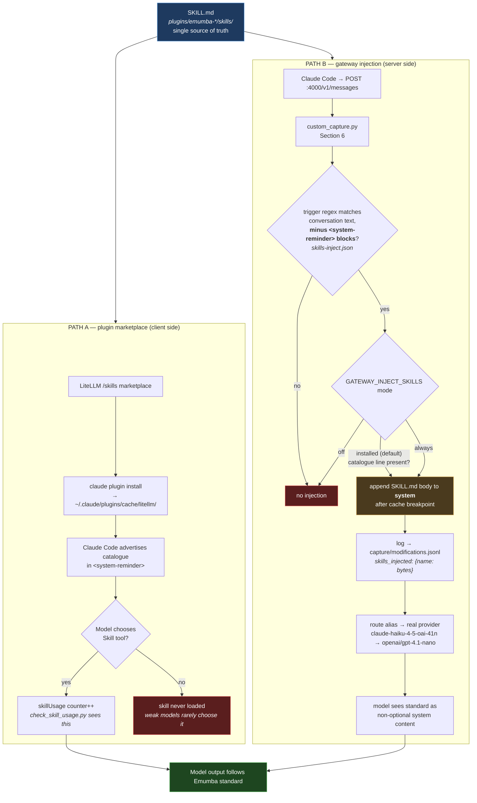

# Emumba control plane — how a skill reaches the model

Two delivery paths, one source of truth (`plugins/*/skills/*/SKILL.md`).

## Where each claim is provable

| Claim | Evidence | Status |
|---|---|---|
| Skill distributed via gateway | `installed_plugins.json` → `@litellm`, not `@inline` | ✅ |
| Trigger fired for this request | `capture/modifications.jsonl` → `skills_injected` | ✅ |
| Body reached the model | `capture/<session>/NNN.*.request.json` → `emumba-gateway-skill:` marker | ✅ |
| Model *applied* the rules | A/B: same question with and without trigger text | ✅ |
| Model chose the Skill tool | `~/.claude.json` → `skillUsage` counter | ❌ never, on weak models |

`SKILL_USED=` in a demo prompt is **self-report** — it is not evidence of any of the above.
Injected blocks now also instruct the model to name the skill when asked, which makes that
self-report **self-fulfilling for path B**. The A/B row is the only one that survives scrutiny.

**Why the trigger excludes `<system-reminder>` blocks (fixed 15 Sep 2026):** one of those blocks
is Claude Code's own skill catalogue, which lists every skill *with its description* — and a
description trips its own trigger. With the catalogue in scope, every installed skill injected on
every request; measured at 17,683 chars on an unrelated file. The bug was invisible at one skill
and appeared only at four. The installed-check below deliberately keeps the full text, because the
catalogue is exactly what *it* reads. See `GATEWAY-MODIFY.md`.
